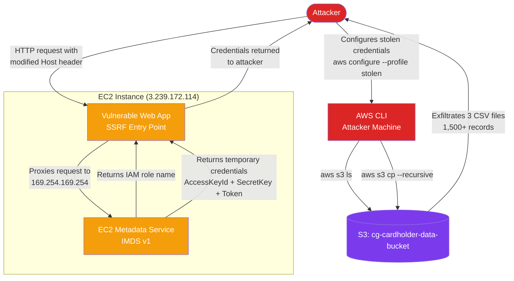
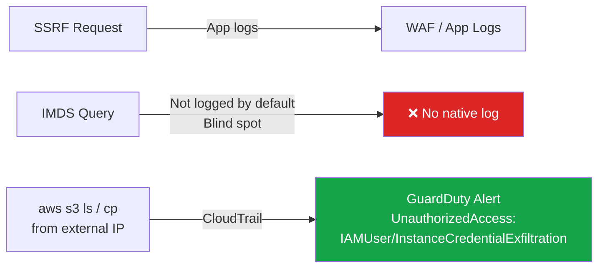

# Attack Flow: cloud_breach_s3

## Overview

This diagram shows the full attack chain used in this lab — from the initial SSRF vulnerability to full S3 data exfiltration.



---

## Step-by-Step

| Step | Action | Result |
|------|--------|--------|
| 1 | Send HTTP request to EC2 with `Host: 169.254.169.254` | SSRF triggers, app proxies to IMDS |
| 2 | Query `/latest/meta-data/iam/security-credentials/` | IAM role name returned |
| 3 | Query `/latest/meta-data/iam/security-credentials/<role>` | Temporary AWS credentials returned |
| 4 | Load credentials into local AWS CLI profile | Now acting as the EC2's IAM role |
| 5 | `aws s3 ls` | Cardholder data bucket discovered |
| 6 | `aws s3 cp --recursive` | Full bucket exfiltrated |

---

## Why This Works

Three misconfigurations stacked on top of each other:

1. **IMDSv1 enabled** — No session token required, SSRF can query IMDS directly
2. **Overly permissive IAM role** — WAF role had `s3:GetObject` on sensitive data it never needed
3. **No S3 bucket policy** — Nothing restricted access to the bucket by IP, VPC endpoint, or principal

Remove any one of these and the attack either fails or the blast radius shrinks significantly.

---

## Detection Points



The credential theft itself (IMDS query) leaves no CloudTrail log — it happens at the instance level. GuardDuty catches the downstream use of the credentials from an external IP.
```
